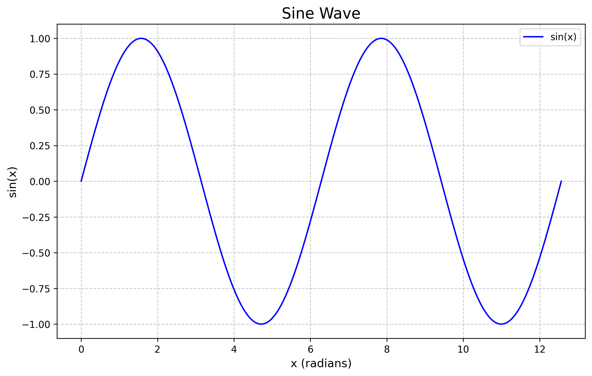

# 正弦波图像

以下是一个正弦波函数 sin(x) 在区间 [0, 4π] 上的图像：



## 代码说明

使用的 Python 代码如下：

```python
import matplotlib.pyplot as plt
import numpy as np

def generate_sine_wave():
    # Generate x values from 0 to 4π
    x = np.linspace(0, 4*np.pi, 1000)
    
    # Generate y values as sine of x
    y = np.sin(x)
    
    # Create the plot
    plt.figure(figsize=(10, 6))
    plt.plot(x, y, label='sin(x)', color='blue')
    plt.title('Sine Wave', fontsize=16)
    plt.xlabel('x (radians)', fontsize=12)
    plt.ylabel('sin(x)', fontsize=12)
    plt.grid(True, linestyle='--', alpha=0.7)
    plt.legend()
    
    # Save the plot as an image
    plt.savefig('sine_wave.png', dpi=300, bbox_inches='tight')
    plt.show()

if __name__ == "__main__":
    generate_sine_wave()
```

该代码使用 numpy 生成了从 0 到 4π 范围内的 1000 个等间距点作为 x 值，并计算对应的 sin(x) 值作为 y 值。然后使用 matplotlib 绘制出平滑的正弦波曲线。